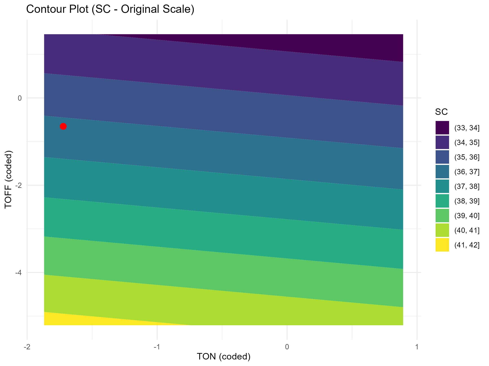
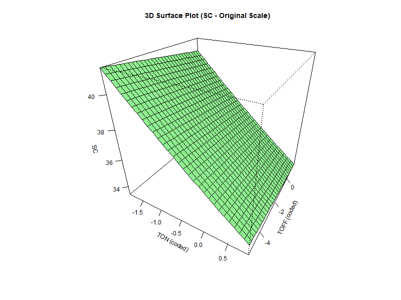
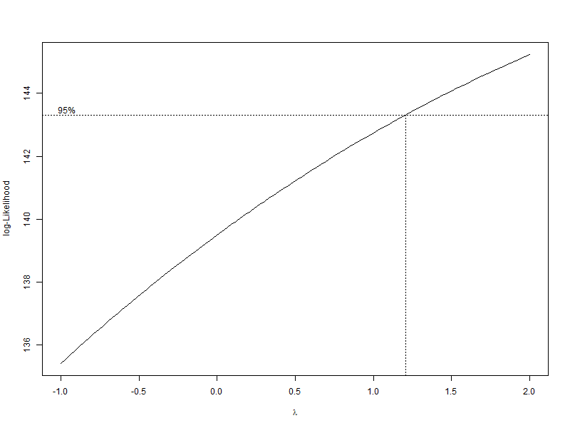
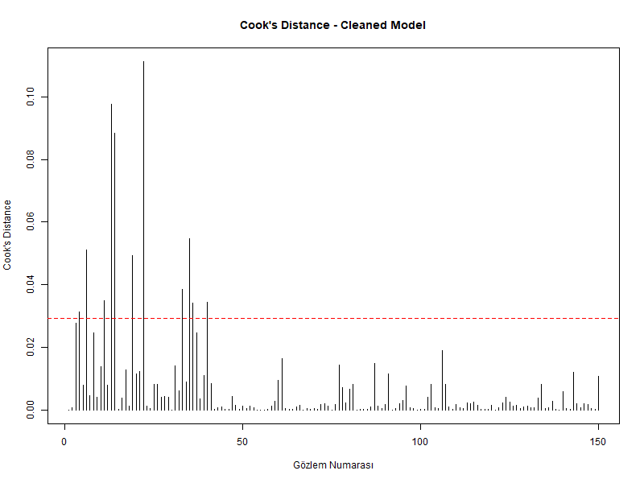
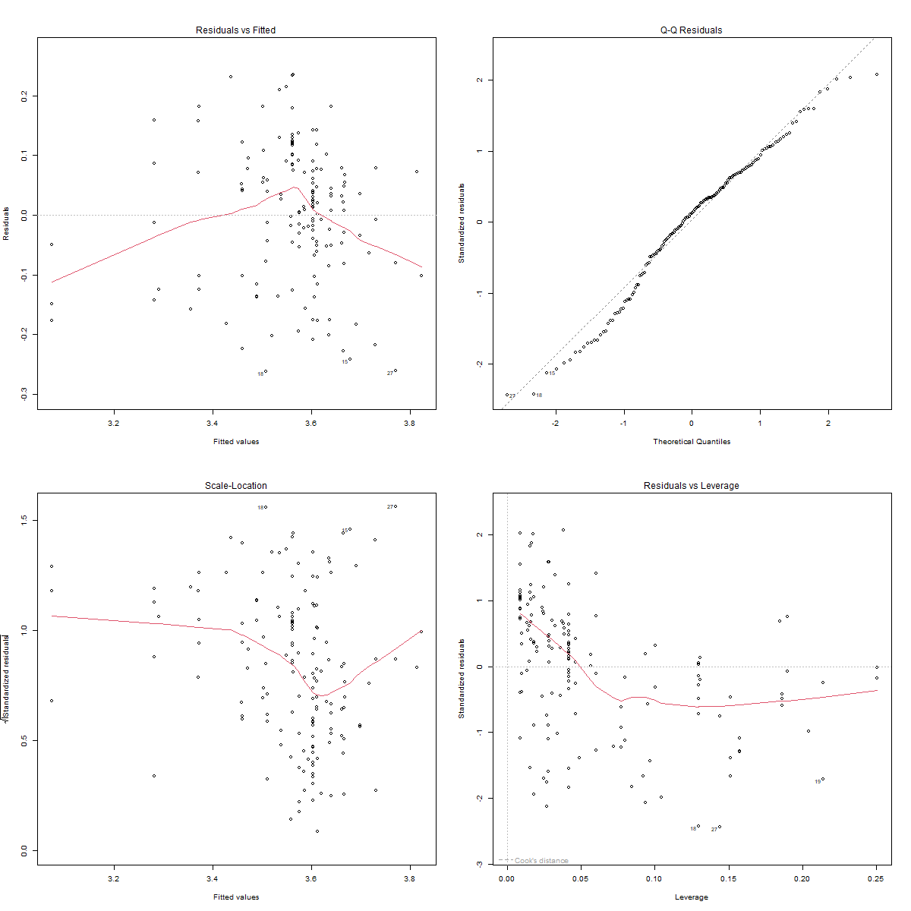

# Yüzey Kimyası Optimizasyonu (RSM) Projesi

Bu proje, dört temel süreç değişkeni (**TON, TOFF, SV, IP**) ile **Yüzey Kimyası (SC)** arasındaki etkileşimleri analiz etmek ve SC değerini maksimize eden optimum çalışma koşullarını belirlemek amacıyla geliştirilmiş **Tepki Yüzeyi Metodolojisi (RSM)** tabanlı istatistiksel modellemeyi kapsamaktadır.  

---

## Proje Problemi ve Amacı

### Problem
- SC üretim sürecindeki değişkenler arasındaki karmaşık etkileşimler, doğrudan gözlemlerle belirlenemiyor.  
- Optimum SC koşullarını deneysel olarak bulmak maliyetli ve zaman alıcı.  

### Çözüm
- **RSM kullanılarak matematiksel modelleme** ile SC yanıtını süreç değişkenleri ile ilişkilendirmek.  
- **Kanonik analiz ve optimizasyon** ile SC’yi maksimize eden koşulları belirlemek.  
- Aykırı değerleri temizleyip model güvenilirliğini artırmak.  

### Projenin Hedefleri
1. SC yanıtını süreç değişkenleri (**TON, TOFF, SV, IP**) ile ilişkilendiren model geliştirmek.  
2. SC’yi maksimize eden optimum kodlanmış ve orijinal (kodlanmamış) değişken değerlerini bulmak.  
3. Modelin varsayımlarını kontrol etmek ve aykırı/etkili gözlemleri temizlemek.  
4. 2D kontur ve 3D grafiklerle değişkenlerin SC üzerindeki etkisini görselleştirmek.  

---

##  Kullanılan Yöntemler ve Analiz

1. **Veri Hazırlığı ve Dönüşüm**
   - SC yanıtı pozitiflik kontrolü: `any(data$SC <= 0)`  
   - Yanıt değişkeni: `log(SC)` (Box-Cox ile doğrulandı)  
   - Tahmin ediciler (**TON, TOFF, SV, IP**) merkezlenip ölçeklendi (kodlanmış değerler)  

2. **İstatistiksel Modelleme**
   - Model denklemi:  
     \[
     \log(SC) \sim \beta_0 + \sum \beta_i x_i + \sum \sum \beta_{ij} x_i x_j
     \]  
   - `rsm` paketi ile model oluşturuldu, ANOVA ve katsayı tabloları incelendi.  

3. **Model Tanılama ve Aykırı Değer Temizliği**
   - ∣Studentized Residuals∣ > 2 olan 11 gözlem çıkarıldı.  
   - Cook’s Distance ve artık grafikleri ile modelin güvenilirliği kontrol edildi.  

4. **Kanonik Analiz ve Optimizasyon**
   - `canonical()` fonksiyonu ile yüzey şekli ve istasyonel nokta belirlendi.  
   - Kodlanmış ve orijinal değişken değerleriyle optimum koşullar hesaplandı.  

---

## Temel Bulgular

### Optimum Koşullar

| Değişken | Kodlanmış Değer | Orijinal Değer |
|----------|----------------|----------------|
| TON      | -1.722         | 6.066          |
| TOFF     | -0.652         | 59.200         |
| SV       | -1.132         | 46.661         |
| IP       | -1.908         | 65.921         |

- Tahmini **SC**: `SC_pred ≈ 34.55`  
- Eigenvalue analizi: karışık işaretler → **saddle point / stationary ridge**  

---

## Görselleştirme

- **Kontur Grafiği:** TON ve TOFF’in SC üzerindeki etkisi.  
    

- **3D Yüzey Grafiği:** Tepki yüzeyi ve değişken etkileşimleri.  
    

- **Model Tanısı:**  
  - Box-Cox:   
  - Cook's Distance:   
  - Artık Grafikleri:   

---

## Çıkarımlar ve Katkılar

- Aykırı gözlemlerin çıkarılması, modelin güvenilirliğini artırdı  
- SC üretim sürecindeki karmaşık değişken etkileşimleri başarıyla modellendi  
- Optimum koşullar, bilimsel ve pratik karar alma süreçlerinde yol gösterici  
- RSM ile optimizasyonun endüstriyel süreçlerde uygulanabilirliğini kanıtladı  

---

## Kurulum ve Kullanım

### Gerekli R Paketleri
```r
install.packages(c("rsm", "readxl", "ggplot2", "dplyr", "MASS"))

library(rsm)
library(readxl)
library(ggplot2)
library(dplyr)
library(MASS)
